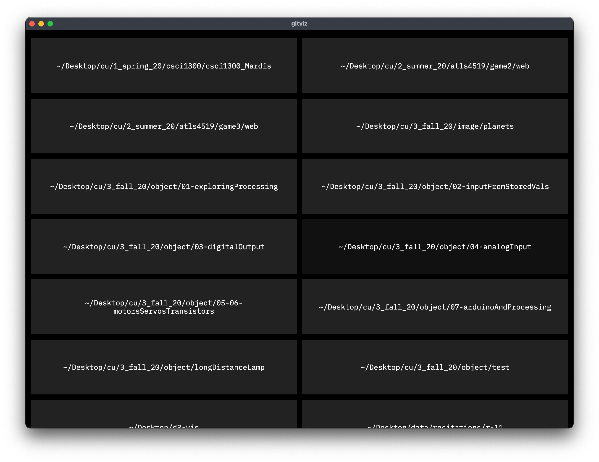
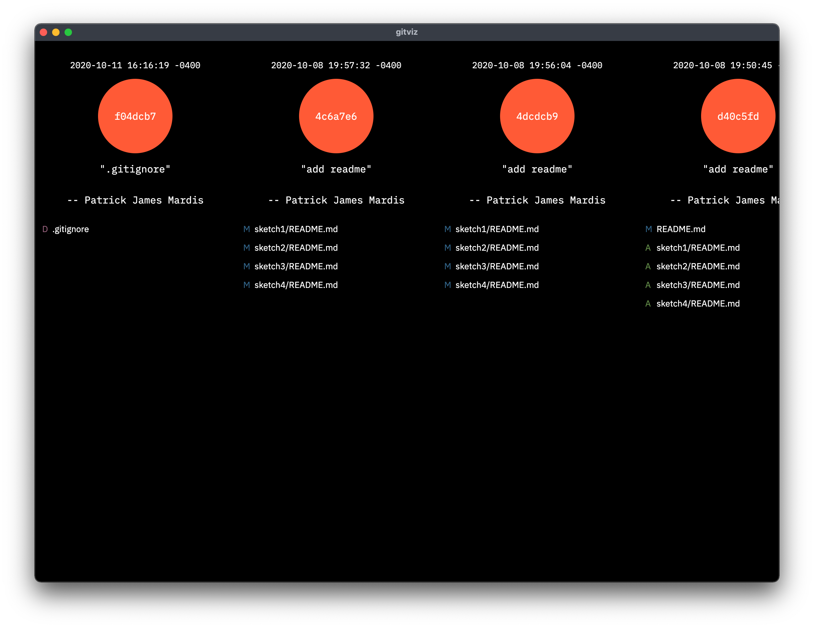

# gitviz
gitviz combines [electron.js](https://www.electronjs.org), [d3](https://d3js.org), and [gitlog](https://www.npmjs.com/package/gitlog) to visualize git commit history in a desktop application. Install the latest realase to get started.



The following tutorials were helpful in understanding the technologies used in this project: 
* [LinkedIn Learning: D3.js Essential Training for Data Scientists](https://www.linkedin.com/learning/d3-js-essential-training-for-data-scientists?u=42275329)
* [LinkedIn Learning: Learning Data Visualization with D3.js](https://www.linkedin.com/learning/learning-data-visualization-with-d3-js?u=42275329)
* [Electron Quick Start Guide](https://www.electronjs.org/docs/tutorial/quick-start#create-a-basic-application)

# main.js
main.js runs Electron's main process and will be the entry point for the app. I begin by including the necessary modules as well as gitinfo.js and config.json files.
```js
const { app, BrowserWindow, TouchBar, ipcMain } = require('electron');
const { TouchBarButton } = TouchBar;
const path = require('path');
const fs = require('fs');
const gitlog = require('gitlog').default;
const gitinfo = require('./gitinfo');
let config = require('./config.json');
```

gitinfo.js exports a class to store information pertaining to a directory. This class's constructor will recursively add any files or directories found after a given parent directory.
```js
class dir {
    constructor(dirpath, depth = 0) {
        this.path = dirpath;
        this.dirs = [];
        this.files = [];
        this.isGit = false;
        this.depth = depth;
        this.id = rand();
        fs.readdirSync(dirpath, { withFileTypes: true }).forEach(item => {
            if (item.name === '.git') this.isGit = true;
            else if (item.isDirectory() && item.name[0] !== '.' && item.name !== 'Library' && item.name !== 'node_modules' && item.name !== 'node_modules.nosync' && item.name !== 'Applications' && item.name !== 'Pictures' && item.name !== 'Music' && item.name !== 'Movies' && item.name !== 'sound' && item.name !== 'premiere' && item.name !== 'out') {
                this.dirs.push(new dir(path.resolve(dirpath, item.name), depth + 1));
            } else {
                this.files.push(path.resolve(dirpath), item.name);
            }
        });
    }
}
```

config.json links directory names to an emoji to use as TouchBar shortcuts when applicable:

```js
{
    "gits": [
        "/Users/patrickjamesmardis/Desktop/dev/boilerplate",
        "/Users/patrickjamesmardis/Desktop/dev/commitment",
        "/Users/patrickjamesmardis/Desktop/dev/devPortal",
        "/Users/patrickjamesmardis/Desktop/dev/exquisiteCorpse",
        "/Users/patrickjamesmardis/Desktop/dev/parallax-narrative",
        "/Users/patrickjamesmardis/Desktop/dev/rover-master",
        "/Users/patrickjamesmardis/Desktop/dev/sassEssentials",
        "/Users/patrickjamesmardis/Desktop/electron-test",
        "/Users/patrickjamesmardis/Desktop/nfm/appleWallet",
        "/Users/patrickjamesmardis/Desktop/sites/millennz",
        "/Users/patrickjamesmardis/Desktop/sites/patrickJames",
        "/Users/patrickjamesmardis/Desktop/xterm-terminal-demo"
    ],
    "emojis": [
        "🥵",
        "🕸",
        "👽",
        "🤖",
        "🛻",
        "🛺",
        "🚀",
        "🔌",
        "💳",
        "👯",
        "💎",
        "💻"
    ]
}
```

The main process can now use the above constructor to search for files starting at ```process.env.HOME```. The entire filesystem is then stored at a variable, ```root```. An array, ```gits```, is then used to store any directories that are flagged as a git repos, and their names are matched to config.json to check for any emoji shortcuts.

```js
let mainWindow;
let gits = [];
const root = new gitinfo(process.env.HOME);

function getGits(n) {
    if (n.isGit) {
        n.name = '~' + n.path.substring(process.env.HOME.length);
        if (config.gits.includes(n.path)) {
            n.emoji = config.emojis[config.gits.indexOf(n.path)];
        }
        gits.push(n);
    }
    n.dirs.forEach(dir => {
        getGits(dir);
    });
}

getGits(root);
```

Next, I use ipcMain's ```.handle()``` method to define responses to requests from the render process. The get event will match the argument to either 'root' or 'gits' and respond with the respective variable. The gitlog event accepts a git repo's path as its argument and responds with the commit history provided by gitlog. The updateEmoji event accpets an array with the repo's path and the new emoji and updates the config file and TouchBar buttons.

```js
ipcMain.handle('get', (event, arg) => {
    if (arg === 'root') {
        return root;
    } else if (arg === 'gits') {
        return gits;
    }
});

ipcMain.handle('gitlog', (event, arg) => {
    const gitlogOptions = {
        repo: arg,
        includeMergeCommitFiles: true,
        number: 200
    }
    return gitlog(gitlogOptions);
});

ipcMain.handle('updateEmoji', (event, arg) => {
    config.emojis[config.gits.indexOf(arg[0])] = arg[1];
    fs.writeFile('./config.json', JSON.stringify(config), err => {
        if (err) throw err;
    });
    buttons.forEach(button => {
        if (button.label == arg[2]) button.label = arg[1];
    });
});
```

Next, electron needs a function to create a window when the app is ready to load. To accomplish this, the ```mainWindow``` variable is replaced with a ```new BrowserWindow()```. This is where the initial width and height are set along with the app's icon and preload script. With these options set, the ```.loadFile()``` method loads index.html into the window. An event listener is also added to replace this variable with null when the window is cloesed.
Once the window is set up, the config.json ```emoji``` array is traversed to fill a ```buttons``` array with ```new TouchBarButton()```. Each button's label is the emoji given from the array and it's click function matches the emoji to its path and tells the render process to visualize its commit history.
These buttons are added to a ```new TouchBar()``` and finally integrated using the window's ```.setTouchBar()``` method.

```js
function touchbarClick(emoji) {
    let dirname = config.gits[config.emojis.indexOf(emoji)];
    mainWindow.webContents.send('touchbar', dirname);
}

function createMainWindow() {
    mainWindow = new BrowserWindow({
        width: 1200,
        height: 900,
        icon: path.join(__dirname, 'build', 'icon.png'),
        webPreferences: {
            nodeIntegration: true,
            preload: path.join(__dirname, 'preload.js')
        }
    });
    mainWindow.loadFile('index.html');
    mainWindow.on('closed', () => {
        mainWindow = null;
    });
    const buttons = [];
    config.emojis.forEach(emoji => {
        buttons.push(new TouchBarButton({
            label: emoji,
            click: () => touchbarClick(emoji)
        }));
    });
    const touchBar = new TouchBar({
        items: buttons
    });
    mainWindow.setTouchBar(touchBar);
}
```

With the ```createMainWindow()``` defined, event listeners can be added to the electron app to create and destory the window when needed.
```js
app.on('ready', createMainWindow);
app.on('window-all-closed', () => {
    if (process.platform !== 'darwin') app.quit();
});
app.on('activate', () => {
    if (mainWindow === null) createMainWindow();
});
```

# preload.js
preload.js runs electron's render process and incorporated d3 to visualize the commit history of a repo. To begin, the preload script includes d3 and electron's ipcRenderer. It then uses the get event to get the gits array from the main process.
```js
const d3 = require('d3');
const { ipcRenderer } = require('electron');
let gits;

ipcRenderer.invoke('get', 'gits').then(res => {
    gits = res;
});
```

I then define a function to visualize a given repo's commit history, ```gitviz(dirname)```. This function begins by hiding the main section and displaying a section for the visualization. It then uses the gitlog event to get the commit history, and uses d3 to parse this into html elements. A listener is also added to call this function when the main process sends a touchbar event.

```js
function gitviz(dirname) {
    d3.select('section#main').style('display', 'none');
    d3.select('section#gitviz').style('display', 'flex');

    ipcRenderer.invoke('gitlog', dirname).then(res => {
        d3.select('section#gitviz')
            .selectAll('div.commit').data(res).enter()
            .append('div').classed('commit', true);
        d3.selectAll('div.commit').data(res)
            .append('p').classed('timestamp', true).text(d => d.authorDate);
        d3.selectAll('div.commit').data(res)
            .append('div').classed('circle', true)
            .html(d => d.abbrevHash).transition().style('opacity', 1);
        d3.selectAll('div.commit').data(res)
            .append('p').classed('message', true).html(d => `"${d.subject}"`);
        d3.selectAll('div.commit').data(res)
            .append('p').classed('author', true).html(d => `-- ${d.authorName}`);
        d3.selectAll('div.commit').data(res)
            .append('div').classed('files', true).append('div').classed('statuses', true)
            .selectAll('p').data(d => d.status).enter()
            .append('p').html(d => d)
            .style('color', d => d == 'M' ? '#33658A' : d == 'A' ? '#628B48' : '#925E78')
        d3.selectAll('div.files').data(res)
            .append('div').classed('names', true)
            .selectAll('p').data(d => d.files).enter()
            .append('p').html(d => d)
    });
}

ipcRenderer.on('touchbar', (e, m) => {
    gitviz(m)
});
```

The rest of the script is wrapped inside a ```DOMContentLoaded``` event listener to ensure the page is ready to be updated. 
Once ready, the main section is filled with the data from the ```gits``` array with event listeners to visualize a repo when clicked.
When applicable, the emojis are added as children divs and receive event listeners to open the an emoji picker when clicked.

```js
window.addEventListener('DOMContentLoaded', () => {
    const emojiPicker = document.querySelector('emoji-picker');
    let currEmoji = null;
    function openEmojiListener(e) {
        emojiPicker.style.display = 'block';
        let xOff = 30;
        let yOff = 30;
        if (e.clientX + emojiPicker.clientWidth >= window.innerWidth) xOff = -1 * emojiPicker.clientWidth - 30;
        if (e.clientY + emojiPicker.clientHeight >= window.innerHeight) yOff = -1 * emojiPicker.clientWidth - 30;
        emojiPicker.style.transform = `translate(${e.clientX + xOff}px, ${e.clientY + yOff}px)`;
        currEmoji = e.target;
        emojiPicker.addEventListener('emoji-click', updateEmojiListener);
        document.querySelector('#main').addEventListener('click', closeEmojiListener);
    }
    function closeEmojiListener(e) {
        if (!e.target.classList.contains('emoji')) {
            emojiPicker.style.display = 'none';
            emojiPicker.removeEventListener('emoji-click', updateEmojiListener);
            document.querySelector('#main').removeEventListener('click', closeEmojiListener);
        }
    }
    function updateEmojiListener(e) {
        if (emojis.includes(e.detail.unicode)) {
            window.alert(`${e.detail.unicode} is already in use by ${gits[emojis.indexOf(e.detail.unicode)].name}`);
        } else {
            let old = currEmoji.innerHTML;
            currEmoji.innerHTML = e.detail.unicode;
            ipcRenderer.invoke('updateEmoji', [gits[emojis.indexOf(old)].path, e.detail.unicode, old]);
            emojis[emojis.indexOf(old)] = e.detail.unicode;
        }
    }
    d3.select('#main')
        .selectAll('div.dir').data(gits).enter()
        .append('div').classed('dir', true)
        .append('p').classed('dirname', true)
        .html(d => d.name).on('click', (e, d) => gitviz(d.path))
    d3.selectAll('div.dir').data(gits).append('div').classed('emoji', true)
        .text(d => d.emoji)
        .on('click', e => openEmojiListener(e));
});
```
